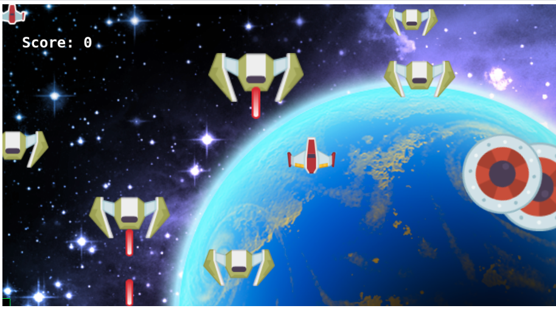

# shooter-plane-game

> This project is a capstone project required by Microverse, after completing the javascript curriculum. This project is a 2D Game built in Javacript and Phaser 3.

    
    
    
    
    

     
     &#10023;
    <a href="#Prerequisites">Watch the Live Version</a> &#10023;
    <a href="#Prerequisites">Prerequisites</a> &#10023;
    <a href="#Getting-Started">Getting Started</a> &#10023;
    <a href="#Usage">Usage</a> &#10023;
    <a href="#Contributing">Contributing</a> &#10023;
    <a href="#Author">Author</a> &#10023;
    <a href="#Show-your-support">Show your support</a> &#10023;
    <a href="#License">License</a> &#10023;
    <a href="#Acknowledgments">Acknowledgments</a> &#10023;
    <a href="https://github.com/pacyL2K19/rpg-game/issues">Report Bug</a>&#10023;

 

<b>Shooter Game - Air Plane Game</b> The main goal of this project is to understand the benefits of modularized code as well as the ability to set up a javascript application made of different modules using webpack and more advanced ES6 features.

## Screenshots

## Watch the Live Version

[Live Demo Link](https://railona.github.io/rpg-plane-game/)

## Rules

- Use direction keys to move the player 
- Escape the enemy and while destroying as many of them as possible
- You choose to submit your score to be ranked among other players

### Prerequisites

- JavaScript ES6
- Text Editor
- Git
- NodeJS
- Webpack

## Features

1. The player can navigate to the following scenes after the game loads
`Credits`: This is where we give credits to the Microverse team, opengameart, and the creator of the game.
`Options`: We can toggle the background music on/off.
`Play`: We navigate the guide scene and understand how to play the game before proceeding.
`Score` : Displays the top five high scores.
2. A player can fire a laser to kill the enemy attacking.
3. The enemy can also fire laser and kill the player.
4. Player can also lose by colliding with the enemy ship.  

## Future Feature (v2.02)

1. Improve the UI
2. Add more levels to the game
3. Each level should have a more enemy and challanges

## Game Design Process (GDD)

At the end of day 2, I have learned the basics of Phaser3. Setting up and creating scenes, adding objects to the scenes, adding collision and assets to the scenes.
The rest of the days are for the following:
- Implement the logic behind the game.
- Implement the service API to record and show user name and score.
- Implement test for our Model and API

## Getting Started

To get a local copy up and running follow these simple example steps.

1. clone Repo: `git clone git@github.com:RailonA/rpg-plane-game.git`
2. Run: `cd rpg-plane-game`
3. Install the needed dependencies :`yarn --init`
4. Run: `npm install`
5. Run :`yarn run webpack serve` ( Use live server on VSCode to open the index.html with your favorite browser )
6. Run all the tests : `yarn run test`

## Authors

👤 **Railon Acosta**
- GitHub: [@railonA](https://github.com/RailonA)
- Linkedin: [@railonAcosta](https://www.linkedin.com/in/railon-acosta-81265180/)
- Twitter: [@railonAcosta](https://twitter.com/RailonAcosta)

## 🤝 Contributing
This project was created for educational purposes as part of the Microverse web development curriculum; contributing is not accepted.

Feel free to check the [issues page](https://github.com/RailonA/rpg-plane-game/issues).

## Show your support

Give us a ⭐️ if you like this project!

## Acknowledgments
- Microverse
- Developers at Open Game Art; Marcus Rasseli, Binngi, Aljazk, Sogomn, Redshrike, Qubodup for the characters, sprites, laser, sound, background music etc
                  
## License

This project is licensed under the MIT License
